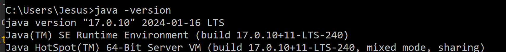

Requirements

1. Download and install java JDK 17
   - https://www.oracle.com/java/technologies/downloads/#jdk17-windows

- test if java installed open terminal
  - `java -version`
  - should be similar to this -
  - if not then you can optionaly update Path JAVA_HOME environment variable to location you installed the java JDK17 package

1. build project using graddle wrapper and run
   - `cd server/`
   - `./gradlew build`
   - `./gradlew bootrun`
   - default port will be 8000
     - example url `http://localhost:8000/api/parts`

# Java project configuration

### Port mapping

port mapping can be changed in the `src/main/resources/application.properties` file

- change `server.port=8000` to desired port number
